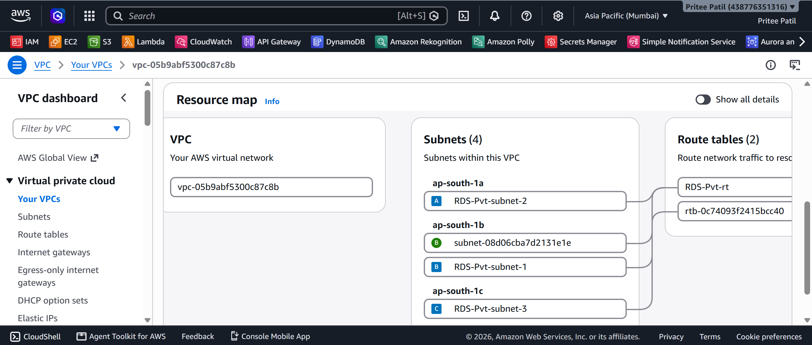
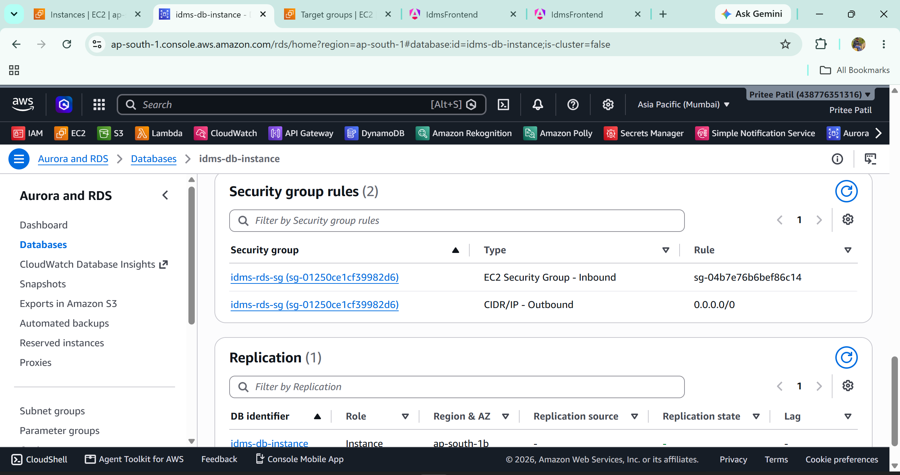
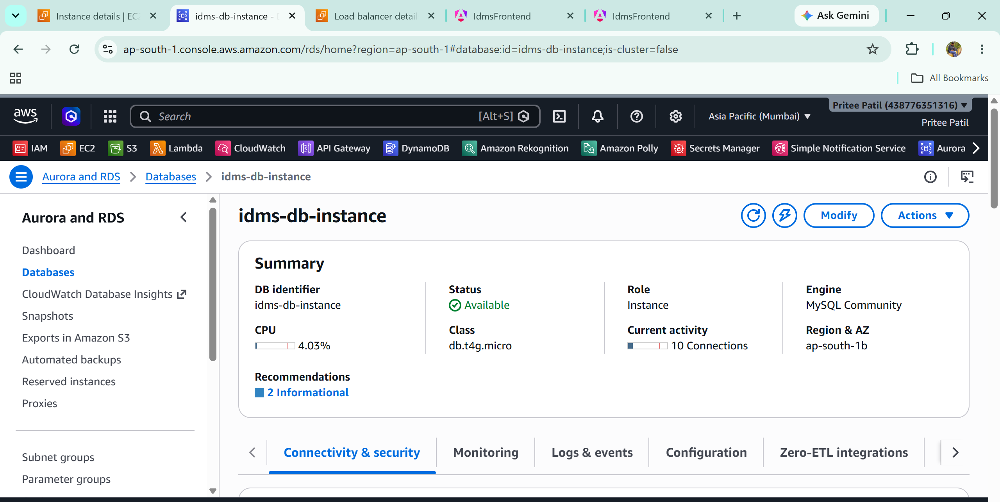
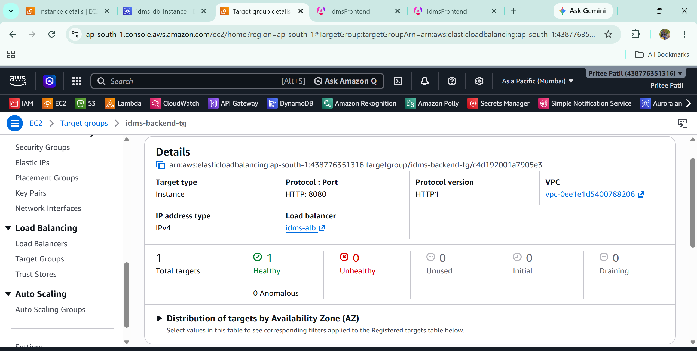
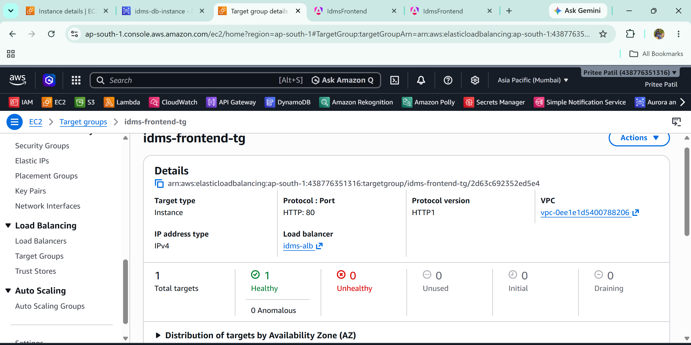
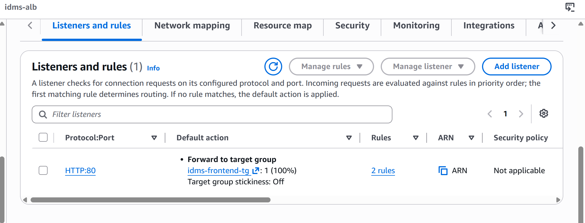
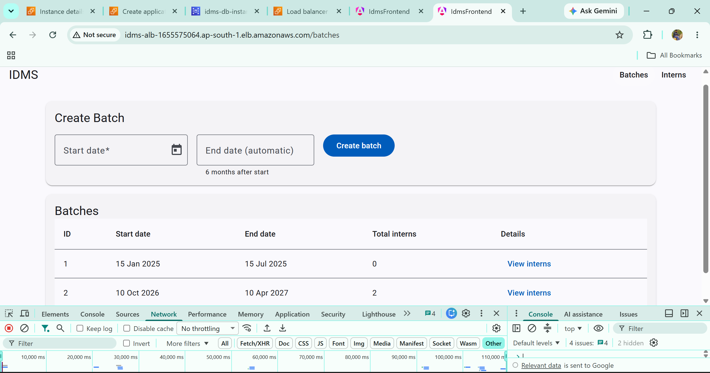
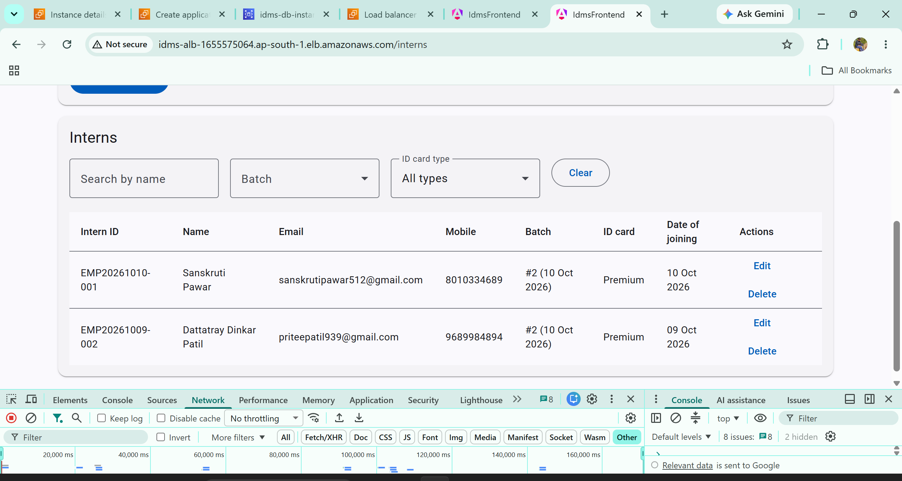
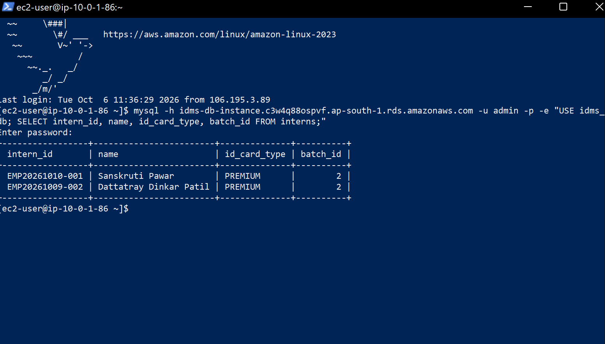

# IDMS: Intern & Batch Data Management System

A full-stack web application to register interns, manage batches, and auto-generate unique intern IDs, deployed as a **three-tier architecture on AWS** (Frontend → Backend → Database).

## 1. Objective

- Manage interns and batches (create, list, search, filter, update, delete).
- Auto-generate intern IDs in the format `EMP<YYYYMMDD>-<NNN>` (Premium card) or `TDA<YYYYMMDD>-<NNN>` (Free card). The number is sequential **per batch**.
- Auto-calculate each batch's end date as **6 months after the start date**.
- Learn how to separate the presentation, application, and data tiers and deploy each one independently on AWS.

## 2. Tech Stack

| Tier | Technology |
|---|---|
| Frontend | Angular 21, Angular Material, nginx |
| Backend | Java 17, Spring Boot 4, Spring Data JPA (Hibernate), Bean Validation, Actuator |
| Database | MySQL 8.0 (Amazon RDS) |

## 3. AWS Services Used

| Service | Purpose |
|---|---|
| **Amazon VPC** | Isolated network (`10.0.0.0/16`) with 2 public and 2 private subnets across 2 Availability Zones |
| **Internet Gateway + Route Tables** | Internet access for public subnets only; the DB subnets have no internet route |
| **Security Groups** | One firewall per tier, chained: ALB → app → database |
| **Amazon EC2** (2 instances) | Backend (Spring Boot jar as a systemd service) and frontend (nginx serving Angular) |
| **Amazon RDS (MySQL)** | Managed database in private subnets, not publicly accessible |
| **Application Load Balancer** | Single entry point; routes `/api/*` to the backend and everything else to the frontend |
| **Target Groups** | Health-checked routing targets for each tier |

## 4. Architecture / Workflow

```
                          Internet
                              │
                   ┌──────────▼──────────┐
                   │ Application Load    │   Security group: idms-alb-sg
                   │ Balancer (port 80)  │   (HTTP 80 from anywhere)
                   └───┬─────────────┬───┘
         /api/*        │             │        everything else
                       ▼             ▼
        ┌──────────────────┐   ┌──────────────────┐
        │ EC2: idms-backend│   │ EC2: idms-frontend│  Security group: idms-app-sg
        │ Spring Boot :8080│   │ nginx :80        │  (80 and 8080 only from the ALB)
        └────────┬─────────┘   └──────────────────┘
                 │ JDBC (3306)
                 ▼
        ┌──────────────────┐
        │ RDS MySQL        │   Security group: idms-rds-sg
        │ (private subnet) │   (3306 only from idms-app-sg)
        └──────────────────┘
```

**Request flow**

1. The browser requests the ALB URL. The ALB forwards page requests to nginx, which serves the Angular build.
2. Angular calls `/api/...` on the same address. The ALB forwards these to Spring Boot on port 8080.
3. Spring Boot reads and writes MySQL on RDS, which is reachable only from the app security group.

**Network layout**

| Subnet | CIDR | AZ | Contents |
|---|---|---|---|
| `idms-public-a` | 10.0.1.0/24 | ap-south-1a | Backend EC2, ALB |
| `idms-public-b` | 10.0.2.0/24 | ap-south-1b | Frontend EC2, ALB |
| `idms-db-a` | 10.0.11.0/24 | ap-south-1a | RDS |
| `idms-db-b` | 10.0.12.0/24 | ap-south-1b | RDS (subnet group requirement) |

## 5. Features

- Intern registration with validation (email format, 10-digit mobile, required batch)
- Intern ID generation, unique per batch via a `(batch_id, sequence_no)` constraint
- Batch creation with automatic end date and live preview
- Search and filter interns by name, batch, and ID card type
- Update intern details (name, email, mobile). The generated ID is never changed.
- Delete interns
- Batch overview with intern list and Premium/Free counts
- Health endpoint (`/actuator/health`) used by the load balancer

## 6. Project Structure

```
idms-project/
├── backend/     Spring Boot application (controller, service, repository, dto, entity, exception, config)
├── frontend/    Angular application (pages, services, models)
├── db/
│   └── schema.sql   Database schema
└── docs/
    └── screenshots/ Screenshots used in this README
```

## 7. REST API

| Method | Endpoint | Description |
|---|---|---|
| POST | `/api/batches` | Create a batch (body: `startDate`) |
| GET | `/api/batches` | List batches with intern counts |
| GET | `/api/batches/{id}` | Get one batch |
| GET | `/api/batches/{id}/interns` | Interns in a batch |
| POST | `/api/interns` | Register an intern (ID is generated) |
| GET | `/api/interns?name=&batchId=&idCardType=` | Search and filter |
| GET | `/api/interns/{id}` | Get one intern |
| PUT | `/api/interns/{id}` | Update name, email, mobile |
| DELETE | `/api/interns/{id}` | Delete an intern |
| GET | `/actuator/health` | Health check |

## 8. Implementation Steps

### Phase A: Local build

1. Installed JDK 17, Maven, Node.js, Angular CLI, MySQL 8, and Git.
2. Designed the schema with `batches` and `interns` tables linked by a foreign key (`db/schema.sql`).
3. Generated the Spring Boot project and connected it to MySQL.
4. Built entities, repositories, DTOs, services, controllers, validation, and global exception handling.
5. Added CORS configuration and the batch overview endpoint.
6. Created the Angular project with Angular Material, then built the Batches, Interns, edit dialog, and Batch Detail pages.
7. Made the app deployment-ready: environment-variable configuration, `/api` same-origin calls with a dev proxy, Actuator health endpoint, and a production build.

### Phase B: AWS deployment

1. **VPC**: created `idms-vpc`, four subnets, an internet gateway, and public/private route tables.
2. **Security groups**: created `idms-alb-sg`, `idms-app-sg`, and `idms-rds-sg`, each accepting traffic only from the previous tier.
3. **RDS**: created a MySQL 8.0 instance in a DB subnet group of private subnets, with public access off.
4. **Backend EC2**: installed Java 17, cloned the repo, built the jar, loaded `db/schema.sql` into RDS, and ran the jar as a systemd service with environment variables from `/etc/idms.env`.
5. **Frontend EC2**: installed nginx with an Angular fallback (`try_files ... /index.html`) and uploaded the `dist/idms-frontend/browser` build.
6. **Load balancer**: created two target groups (frontend on port 80, backend on port 8080), an ALB, and a path rule sending `/api/*` to the backend.
7. **Testing**: verified the full flow through the ALB, and confirmed that direct access to the EC2 instances and database is blocked.
8. **Cleanup**: deleted all billable resources.

## 9. Screenshots


| Item | Screenshot |
|---|---|
| VPC and subnets |  |
| Route tables |  |
| Security group rules |  |
| RDS instance (public access: No) |  |
| Backend service running and health `UP` |  |
| Frontend service running and health |  |
| ALB listener rule `/api/*` |  |
| App: Batches page |  |
| App: Interns page with generated IDs |  |
| Data in RDS (`SELECT` on `interns`) |  |


## 10. How to Run Locally

**Prerequisites:** JDK 17, Maven (or the included `mvnw`), Node.js 20+, Angular CLI, MySQL 8.

**1. Database**

```bash
mysql -u root -p < db/schema.sql
```

**2. Backend** (PowerShell shown; use `export` on Linux/macOS)

```powershell
cd backend
$env:DB_PASSWORD='your_mysql_password'
.\mvnw spring-boot:run
```

Check: `http://localhost:8080/actuator/health` should return `UP`.

**3. Frontend**

```bash
cd frontend
npm install
npm start
```

Open `http://localhost:4200`. The dev server proxies `/api` to `localhost:8080`.

**Backend environment variables**

| Variable | Default | Purpose |
|---|---|---|
| `DB_URL` | local MySQL URL | JDBC URL |
| `DB_USERNAME` | `root` | Database user |
| `DB_PASSWORD` | none (required) | Database password |
| `CORS_ORIGINS` | `http://localhost:4200` | Allowed browser origins |

## 11. How to Deploy on AWS

1. Create the VPC, subnets, internet gateway, and route tables (Section 4).
2. Create the three security groups, referencing the previous tier's group as the source.
3. Create the RDS MySQL instance in the private subnet group with `idms-rds-sg` and public access off.
4. Launch the backend EC2 (Amazon Linux 2023) in a public subnet with `idms-app-sg`, then:

   ```bash
   sudo dnf install -y java-17-amazon-corretto-headless git mariadb105
   git clone https://github.com/<your-username>/idms-project.git
   mysql -h <rds-endpoint> -u admin -p < idms-project/db/schema.sql
   cd idms-project/backend && ./mvnw clean package -DskipTests
   sudo mkdir -p /opt/idms && sudo cp target/idms-backend-0.0.1-SNAPSHOT.jar /opt/idms/idms-backend.jar
   ```

   Create `/etc/idms.env` (permissions `600`) with `DB_URL`, `DB_USERNAME`, `DB_PASSWORD`, and `CORS_ORIGINS`. Then create the `idms-backend` systemd service and run `sudo systemctl enable --now idms-backend`.

5. Build the frontend with `ng build`. Launch the frontend EC2 in a second public subnet, install nginx, add the Angular fallback config, and copy `dist/idms-frontend/browser/*` to `/usr/share/nginx/html/`.
6. Create target groups: `idms-frontend-tg` (port 80, health path `/`) and `idms-backend-tg` (port 8080, health path `/actuator/health`).
7. Create an internet-facing ALB with `idms-alb-sg`. The default action forwards to the frontend target group. Add a rule: path `/api/*` forwards to the backend target group.
8. Open the ALB DNS name in a browser.

**Cost note:** the ALB, EC2 instances, and RDS instance bill while running. Delete or stop them when you finish.

## 12. Security Notes

- The database password is read from an environment variable and is never committed to Git.
- RDS is in private subnets with no public access, and accepts connections only from the app security group.
- The EC2 instances accept web traffic only from the load balancer. SSH is restricted to a single IP.
- Intern IDs and sequence numbers are not updatable after creation.

## 13. Key Learnings

**Architecture and networking**
- A three-tier design is easiest to secure when each tier has its own security group. Using a security group as the *source* of a rule (instead of an IP range) means only resources attached to that group can connect.
- Public and private subnets decide what can reach the internet. A private DB subnet with no internet route keeps the database unreachable from outside the VPC.
- An ALB and an RDS subnet group each need subnets in at least two Availability Zones.
- Path-based routing on one ALB (`/api/*` to the backend, everything else to the frontend) lets the frontend call `/api` on the same origin, which avoids CORS problems in production.

**Backend**
- Keep secrets out of source control: reading `DB_PASSWORD` from an environment variable (and from `/etc/idms.env` on EC2 with `chmod 600`) is safer than hardcoding it.
- Enforce business rules in the database as well as the code. The unique `(batch_id, sequence_no)` constraint protects intern IDs even if two requests arrive at the same time.
- `ddl-auto=validate` catches mismatches between entities and the schema without letting Hibernate change tables.
- Running the jar as a `systemd` service gives automatic restart and start on boot.
- A health endpoint (`/actuator/health`) gives the load balancer something reliable to check.

**Frontend**
- Angular routes live in the browser, so nginx needs `try_files ... /index.html` or deep links like `/interns` return 404.
- Using `toISOString()` for dates can shift the day by one in timezones ahead of UTC, so dates are formatted from local time instead.
- Keeping the API address in one environment file made the move from `localhost` to `/api` a one-line change.

**Deployment and troubleshooting**
- `Connection timed out` on SSH usually means a security group rule, and "My IP" rules break when your IP changes.
- EC2 public IPs and DNS names change after a stop and start.
- A t3.micro has only 1 GB of RAM, so building Spring Boot on it needed swap space.
- GitHub no longer accepts account passwords for Git, so a personal access token is needed for private repos.
- An empty environment variable gives a misleading `401`, so checking `${#TOKEN}` showed the real problem quickly.
- Errors such as `Session is invalid` in the AWS Console can come from an expired login, not from wrong settings.
- PowerShell removes quote escapes in `curl.exe -d`, so `Invoke-RestMethod` or a JSON file is more reliable.
- IDE errors (such as Lombok in Eclipse) can appear even when Maven builds fine, so the command line is the source of truth.

**Cost and operations**
- ALB, EC2, and RDS all bill by the hour. Deleting resources in the right order (ALB, target groups, instances, RDS, security groups, VPC) avoids dependency errors.
- Building with the Maven wrapper and saving `schema.sql` in the repo made the whole environment rebuildable.

## 14. Future Enhancements

- Role-based access (Admin, Manager) with Spring Security and JWT
- Email/SMS notifications when interns are assigned to batches
- Intern performance tracking and evaluation
- HTTPS using ACM and an HTTPS listener on the ALB
- Auto Scaling group, CI/CD pipeline, and infrastructure as code

## Author

Pritee Patil